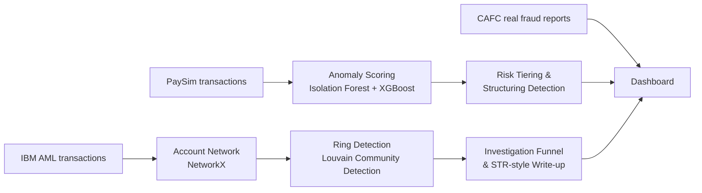

# Fraud & AML Detection Dashboard — Canadian Banking

A two-stage fraud and anti-money-laundering analytics pipeline: transaction-level
anomaly scoring feeds into account-network analysis that surfaces likely
structuring/layering rings — the same detect → investigate workflow banks use,
built end-to-end from raw data to an interactive dashboard.

**[Investigation case study (PDF)](./investigation_summary.pdf)** · **[Project overview deck (PPTX)](./project_overview.pptx)** · **[Live dashboard setup ↓](#running-the-dashboard)**

---

## Why this project

Canadian banks lose hundreds of millions annually to fraud, and FINTRAC's
regulatory expectations around anti-money-laundering detection keep rising.
Most fraud tools stop at flagging individual transactions; most AML tools
start from a manual account lookup. This project connects the two: a flagged
transaction automatically pulls in its account network, and community
detection on that network surfaces the rings a single-transaction view would
never catch.

| | |
|---|---|
| **Real data** | Canadian Anti-Fraud Centre — 350,000+ individual fraud reports (2021–2025), plus Statistics Canada population/crime data |
| **Synthetic data** | PaySim (6.3M labeled transactions) and IBM's AML dataset (labeled laundering rings) — see [Data & limitations](#data-sources--honest-limitations) for why |
| **Output** | A 9-chart, role-based Streamlit dashboard + a FINTRAC-STR-style investigation write-up generated from a detected ring |

## How it works



**Stage 1 — score:** every transaction gets an anomaly score (unsupervised
Isolation Forest) and a fraud probability (supervised XGBoost), then buckets
into Low/Medium/High/Critical risk tiers.

**Stage 2 — investigate:** accounts connected to a flagged transaction are
pulled into a directed graph; Louvain community detection groups them into
clusters, and any cluster moving more than a set CAD threshold generates an
investigation-ready summary.

## Dashboard

Four role-based views, one dashboard, matching how a real fraud/AML team is
actually organized:

| View | Charts |
|---|---|
| **Fraud Operations** | Report volume over time · Anomaly score distribution · Risk tier breakdown · Structuring detection near the $10,000 CAD threshold |
| **AML / Compliance** | Flagged activity by province (choropleth) · Account network graph · Ring size distribution · Alert-to-STR investigation funnel |
| **Data Science** | Model precision / recall / F1 over sequential evaluation batches |
| **Executive Summary** | KPI tiles, trend line, funnel snapshot |

*(Add a screenshot or two here once you've run it — `dashboard_screenshot.png` — this is the single highest-impact thing you can add before sharing the repo.)*

## Case study

The investigation write-up (`investigation_summary.pdf`) walks one detected
ring from the transaction that triggered the anomaly model through to a
FINTRAC-STR-formatted recommendation — subject accounts, transaction
timeline, indicators matched, and grounds for suspicion. It's built to show
how the pipeline's output becomes something a compliance analyst could
actually act on, not just a model score.

## Tech stack

| Layer | Tools |
|---|---|
| Data cleaning & features | Python, pandas, NumPy |
| Anomaly / fraud scoring | scikit-learn (Isolation Forest), XGBoost |
| Network & ring detection | NetworkX, python-louvain (Louvain) |
| Dashboard & visualization | Streamlit, Plotly |
| Storage between stages | Parquet (pyarrow) |

## Project structure

```
├── src/
│   ├── config.py                          # all file paths, one place
│   ├── 01_clean_cafc.py                   # real data → Charts 1, 4
│   ├── 02_clean_population.py             # per-capita normalization
│   ├── 03_feature_engineering_paysim.py   # transaction features
│   ├── 04_train_anomaly_model.py          # Charts 2, 3, 5
│   ├── 05_model_monitoring.py             # Chart 8
│   ├── 06_build_aml_network.py            # Chart 6
│   └── 07_community_detection_and_funnel.py  # Charts 7, 9
├── dashboard/
│   └── app.py                             # Streamlit app, 4 role-based views
├── data/
│   ├── raw/                               # place downloaded source files here
│   └── processed/                         # pipeline outputs (parquet)
├── investigation_summary.pdf              # case study write-up
├── project_overview.pptx                  # project overview deck
└── requirements.txt
```

## Running it

```bash
python3 -m venv venv
source venv/bin/activate        # Windows: venv\Scripts\activate
pip install -r requirements.txt
```

Place the real CAFC CSV in `data/raw/`, then download and place these four
(all free — see table below for links):

| File | Save as |
|---|---|
| StatCan population, Table 17-10-0009-01 | `data/raw/1710000901-eng.csv` |
| PaySim | `data/raw/PS_20174392719_1491204439457_log.csv` |
| IBM AML (HI-Small variant) | `data/raw/HI-Small_Trans.csv` |
| Canada province boundaries (GeoJSON) | `data/raw/canada_provinces.geojson` |

Run the pipeline in order:

```bash
cd src
python 01_clean_cafc.py
python 02_clean_population.py
python 03_feature_engineering_paysim.py
python 04_train_anomaly_model.py
python 05_model_monitoring.py
python 06_build_aml_network.py
python 07_community_detection_and_funnel.py
```

### Running the dashboard

```bash
cd ..
streamlit run dashboard/app.py
```

## Data sources & honest limitations

Real, individual bank transaction data isn't publicly available anywhere —
by any bank, in any country — because of privacy law (in Canada: PIPEDA and
the Bank Act). This is normal and expected for a project like this; it's why
PaySim and IBM's AML dataset are the accepted industry-standard substitutes
used across fraud/AML research and tooling. This project grounds what *can*
be real — report volume, geography, demographics, dollar-loss trends — in
actual CAFC and StatCan data, and uses synthetic engines only where real data
structurally cannot exist.

Two limitations worth stating plainly:
- PaySim and IBM AML are separate synthetic datasets with no shared account
  IDs, so the investigation funnel (Chart 9) illustrates workflow *shape*,
  not a literally joined pipeline. A production system would run both stages
  on one unified transaction feed.
- No public dataset exposes payment method (e-Transfer, wire, crypto, etc.)
  at the individual-report level — only in CAFC's own aggregate PDF — so that
  dimension is omitted rather than fabricated.

## Data source links

- [CAFC Open Data — fraud reports](https://open.canada.ca/data/en/dataset/6a09c998-cddb-4a22-beff-4dca67ab892f)
- [CAFC 2024 Annual Statistical Report](https://antifraudcentre-centreantifraude.ca/annual-reports-2024-rapports-annuels-eng.htm)
- [StatCan Table 17-10-0009-01 — Population estimates](https://www150.statcan.gc.ca/t1/tbl1/en/tv.action?pid=1710000901)
- [StatCan Table 35-10-0177 — Incident-based crime statistics](https://www150.statcan.gc.ca/t1/tbl1/en/tv.action?pid=3510017701)
- [PaySim (Kaggle)](https://www.kaggle.com/datasets/ealaxi/paysim1)
- [IBM AML dataset (Kaggle)](https://www.kaggle.com/datasets/ealtman2019/ibm-transactions-for-anti-money-laundering-aml)
- [FINTRAC — STR guidance](https://fintrac-canafe.canada.ca/guidance-directives/transaction-operation/str-dod/str-dod-eng)

## Future work

- Replace the two-dataset workaround with a single unified synthetic
  transaction feed so the investigation funnel reflects one continuous
  pipeline rather than two joined-in-spirit stages.
- Add authentication and real role-based access control (currently a
  dropdown selector, not enforced access).
- Move from batch parquet files to a streaming/scheduled pipeline for a
  closer-to-real-time demo.

## Author

Jatin Sagwal
